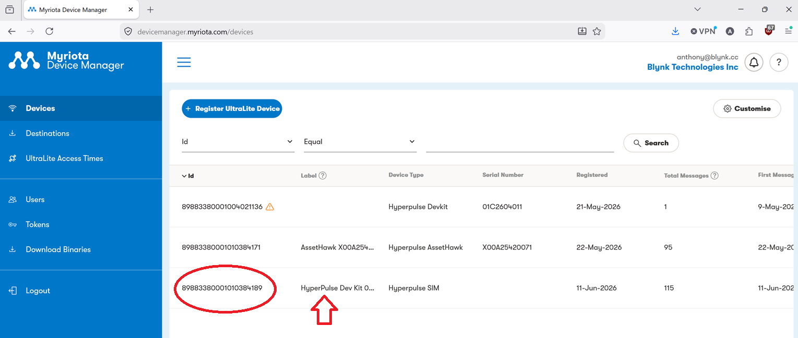

# Connect a Myriota HyperPulse to Blynk

## Introduction

This guide walks through connecting a [Myriota HyperPulse](https://myriota.com) satellite-connected devkit to the [Blynk IoT platform](https://blynk.io). The HyperPulse transmits sensor data via the Myriota satellite network; Blynk receives and visualises that data through its Data Converter pipeline.

By the end of this guide, your HyperPulse readings will appear live on your Blynk dashboard and mobile app.

---

## Prerequisites

- A Myriota HyperPulse device, registered in Myriota Device Manager
- A Blynk account (Free, Plus, or Pro)
- Access to Myriota Device Manager

---

## Step 1 — Install the Blynk Blueprint

Blueprints are pre-built templates that configure your Blynk workspace with the correct datastreams, dashboard widgets, and Data Converter script for a specific device type.

---

## Step 2 — Find the Data Converter Endpoint URL in Your Blynk Template

The Data Converter exposes an HTTPS endpoint that Myriota Device Manager will POST decoded payloads to.

1. In Blynk Console, go to **Templates** and open the HyperPulse template.
2. Select the **Data Converter** tab.
3. Copy the **Endpoint URL** — it will look similar to:

   ```
   https://fra1.blynk.cloud/converter/<your_token>
   ```

4. Keep this URL to hand; you will need it in Step 4.

---

## Step 3 — Find or Add Your Device in Myriota Device Manager

1. Log in to [Myriota Device Manager](https://devicemanager.myriota.com).
2. Navigate to **Devices** and locate your HyperPulse by its **Module ID** (printed on the device label).
3. If the device is not listed, select **Add Device**, enter the Module ID and any required registration details, then confirm.
4. Note the **Device ID** — you will need it in Step 6.



---

## Step 4 — Create a Destination for the Data Converter in Myriota Device Manager

A Destination tells Myriota Device Manager where to forward decoded uplink messages.

1. In Myriota Device Manager, go to **Destinations** → **Add Destination**.
2. Configure the destination as follows:

   | Field | Value |
   |---|---|
   | **Name** | `Blynk HyperPulse` (or any descriptive name) |
   | **Type** | `HTTP` |
   | **URL** | The Blynk Data Converter Endpoint URL from Step 2 |
   | **Method** | `POST` |
   | **Content-Type** | `application/json` |

3. Save the destination.

---

## Step 5 — Add the Destination to the Device

1. In Myriota Device Manager, open your HyperPulse device (from Step 3).
2. Navigate to the **Destinations** section of the device settings.
3. Select **Add Destination** and choose the destination created in Step 4.
4. Save the device configuration.

Myriota will now forward all uplink messages from this device to your Blynk Data Converter endpoint.

---

## Step 6 — Activate a New Device in Blynk

1. In Blynk Console, go to **Devices** → **Add New Device**.
2. Select **From Template** and choose the HyperPulse template installed in Step 1.
3. Give the device a name (e.g. `HyperPulse - Site A`) and click **Create**.
4. The device will be created in an inactive state until it receives its first message.

---

## Step 7 — Set the Blynk Device `TerminalId` with the Myriota Device ID

The Data Converter uses the `TerminalId` metadata field to match incoming Myriota messages to the correct Blynk device.

1. In Blynk Console, open the newly created device.
2. Go to **Device Info** → **Metadata**.
3. Find the **TerminalId** field and enter the Myriota **Device ID** noted in Step 3 (e.g. `ABC123DEF456`).
4. Save the metadata.

> **Important:** The `TerminalId` value must match the Myriota Device ID exactly, including letter case.

---

## Waiting for Data

Your pipeline is now fully configured. On the next satellite pass, the HyperPulse will transmit a reading which will travel:

```
HyperPulse → Myriota Satellite Network → Myriota Device Manager → Blynk Data Converter → Blynk Device
```

Depending on satellite coverage and the device's transmission schedule, the first reading may take minutes to a few hours to arrive. Once received, sensor values will populate your Blynk dashboard widgets and be visible in the Blynk mobile app.

You can monitor incoming messages under **Devices** → your device → **Timeline** in the Blynk Console.

---

## Troubleshooting

| Symptom | Check |
|---|---|
| No data appearing in Blynk | Verify the Destination URL in Myriota Device Manager matches exactly the Blynk endpoint from Step 2 |
| Data arriving but wrong device updated | Confirm the `TerminalId` metadata value matches the Myriota Device ID precisely |
| Data Converter errors in Blynk | Review the converter script logs under **Templates** → **Data Converter** → **Logs** |
| Device not transmitting | Check Myriota Device Manager for last-seen timestamp and satellite pass schedule |

---

## Resources

- [Blynk Documentation](https://docs.blynk.io)
- [Myriota Developer Documentation](https://docs.myriota.com)
- [Blynk Community Forum](https://community.blynk.cc)
- [Myriota Support](https://myriota.com/support)
